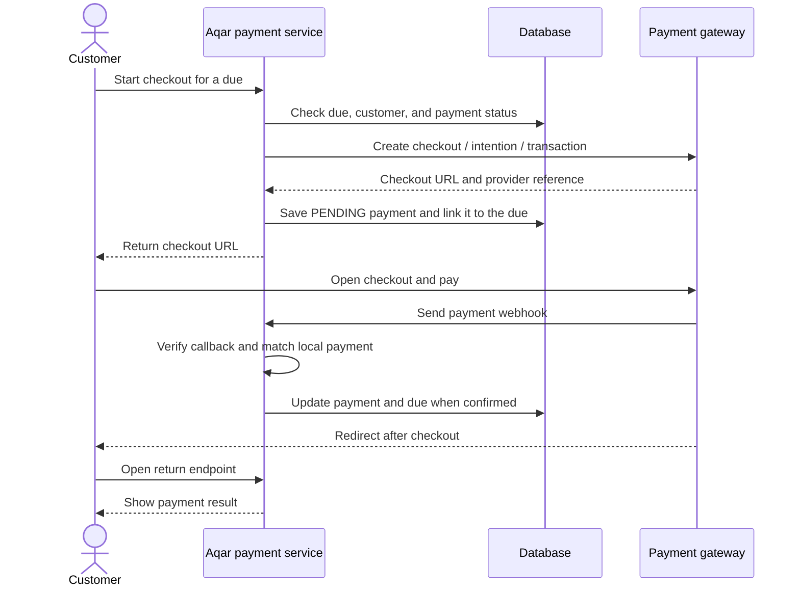

# Aqar payment backend

This Spring Boot service lets a customer pay a **payment due** through Fawaterk, Paymob, or Stripe. The customer pays on the gateway's hosted checkout page; this service keeps the local payment records and receives the result.

## The two records

- `PaymentDues` is the amount the customer owes. It stays `PENDING` until a payment is confirmed.
- `Payment` is one attempt to pay that due. It stores the gateway, checkout URL, provider reference, and status (`PENDING`, `PAID`, or `FAILED`). A due can have more than one attempt if an earlier one fails or expires.

When an attempt fails, the due remains payable. When a payment is confirmed, both the attempt and the due become `PAID`.

## Payment flow

The webhook and browser redirect can arrive in either order. A redirect alone does not always mean the payment succeeded. Paymob and Stripe return endpoints mainly show the result already in the database; the webhook updates it. Fawaterk's success endpoint also asks Fawaterk for transaction details and can record a confirmed payment.

## Gateway differences

| | Fawaterk | Paymob | Stripe |
| --- | --- | --- | --- |
| Start checkout | Create a transaction using an OAuth access token | Create an intention using the Paymob secret key | Create a Checkout Session using the Stripe secret key |
| Customer opens | Fawaterk checkout URL | Paymob Unified Checkout URL | Stripe Checkout URL |
| Provider reference saved | `intent_key` | Intention ID and order ID | Checkout Session ID (`cs_...`) |
| Webhook verification | Calculate and compare the Fawaterk hash | Verify Paymob HMAC | Verify `Stripe-Signature` against the **raw** request body |
| Browser return | Separate success, pending, and fail URLs | One `/return` URL with signed query parameters | Success URL with `session_id`; cancel URL if the customer leaves Checkout |
| Current payment methods | Hosted checkout has been tested with card and a Fawry reference code | The intention currently sends the **card integration ID only** | Hosted Checkout is used for a one-time payment |

### Fawaterk

`POST /fawaterk/dues/{dueId}/createTransaction` creates a transaction and returns its checkout URL. If the same due already has a live Fawaterk checkout, the service returns that URL again. A live checkout from another gateway is rejected here.

Fawaterk can redirect to `/fawaterk/success`, `/fawaterk/pending`, or `/fawaterk/fail`. A Fawry reference code is a **pending** payment: generating the code does not mark the due paid. The success endpoint checks Fawaterk's transaction details before recording `PAID`. The paid and failed webhooks are received at `POST /webhooks/fawaterak/paid_json` and `POST /webhooks/fawaterak/failed_json` (the route spelling matches the current code).

### Paymob

`POST /paymob/dues/{dueId}/createIntention` creates a card intention and returns the Unified Checkout URL. Paymob sends a transaction callback to `POST /paymob/webhook?hmac=...`. After verifying the HMAC and matching the order, amount, currency, and integration ID, the service leaves a pending transaction alone, records a successful one as paid, or marks a failed attempt as `FAILED`.

`GET /paymob/return` validates the signed redirect parameters and displays the local result. It does not change the payment status. The current intention request sends only the card integration ID; Paymob wallet and Fawry methods are not wired into this flow yet.

### Stripe

`POST /stripe/dues/{dueId}/checkout` creates a Checkout Session and returns its URL. If that due already has a live Stripe session, the service returns the existing URL. The successful Checkout redirect goes to `/stripe/success?session_id=...`; leaving Checkout goes to the current `/stripe/cancle` route. Leaving Checkout is not treated as a failed charge.

Stripe sends events to `POST /stripe/webhook`. The service verifies the signature first, then uses Checkout Session events to record paid, pending, failed, or expired attempts. `payment_intent.payment_failed` is acknowledged without closing the due. The success endpoint retrieves the Session from Stripe and shows Stripe's status alongside the local status; it may show that the webhook has not updated the database yet.

## Running locally

1. Use Java 17 and MySQL.
2. Copy `src/main/resources/application.properties.example` to `src/main/resources/application.properties` and fill in your local database, JWT, and gateway values. The real properties file is ignored by Git. Also set `fawaterk.success-url`, `fawaterk.pending-url`, and `fawaterk.fail-url` in your local file; the service uses these for Fawaterk redirects.
3. Configure each gateway's webhook and return URLs to point to your reachable application. Paths above are relative to `server.servlet.context-path` (for example, `/api/payment` if configured that way).
4. Start the service with `./mvnw spring-boot:run`.

Keep API keys and webhook signing secrets in the ignored local properties file. Do not commit them.
